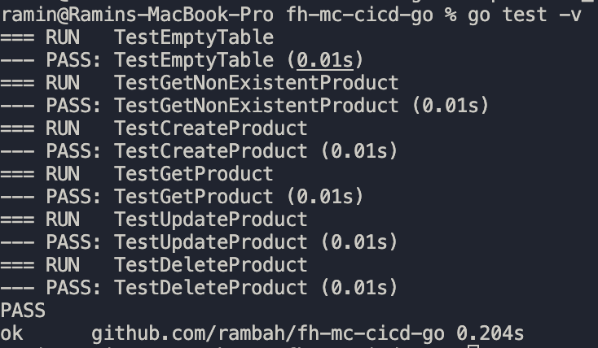
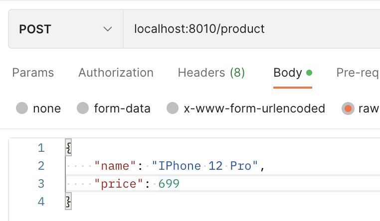
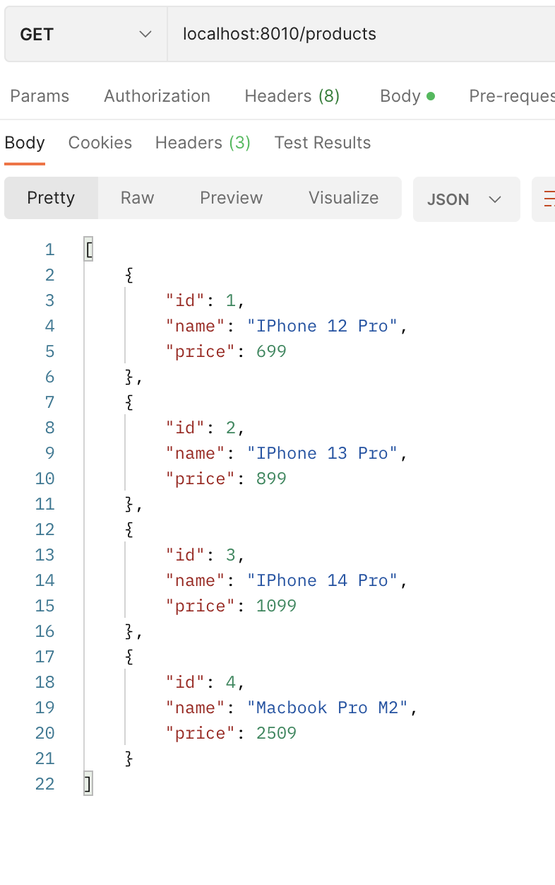
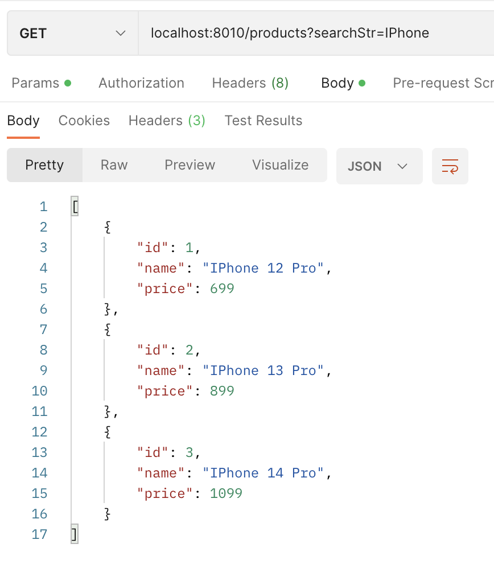
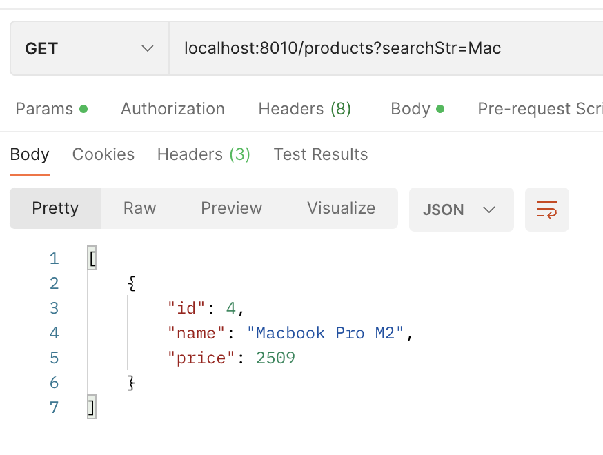
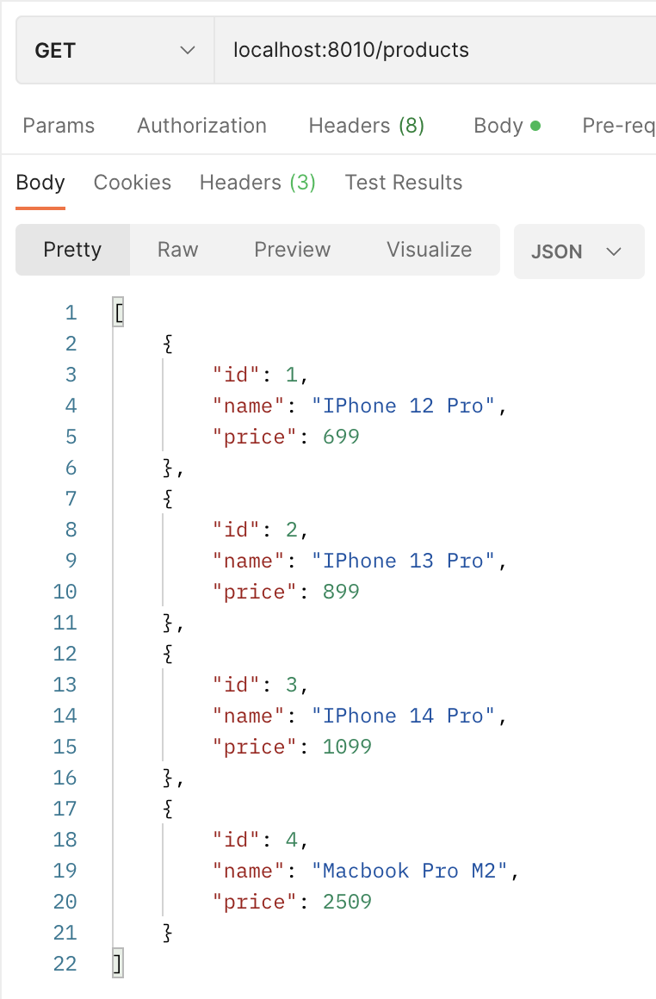
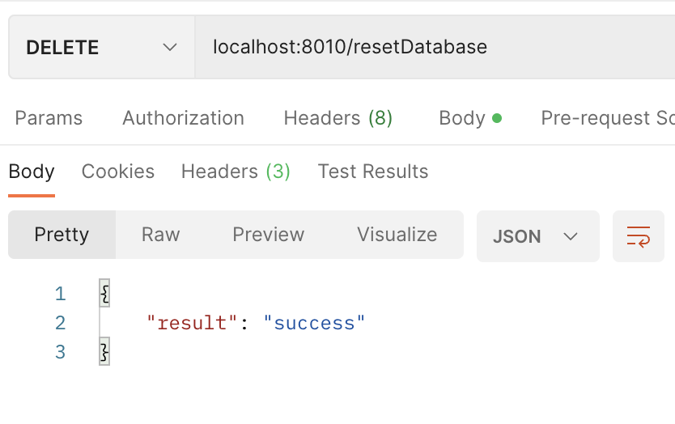
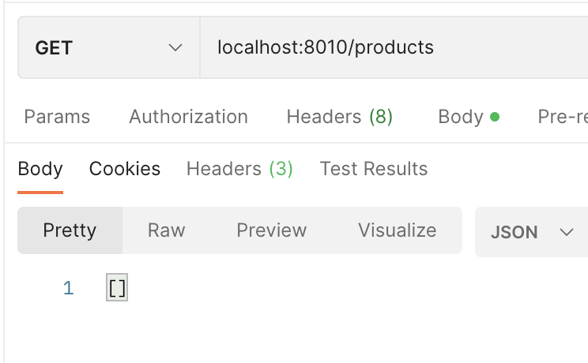
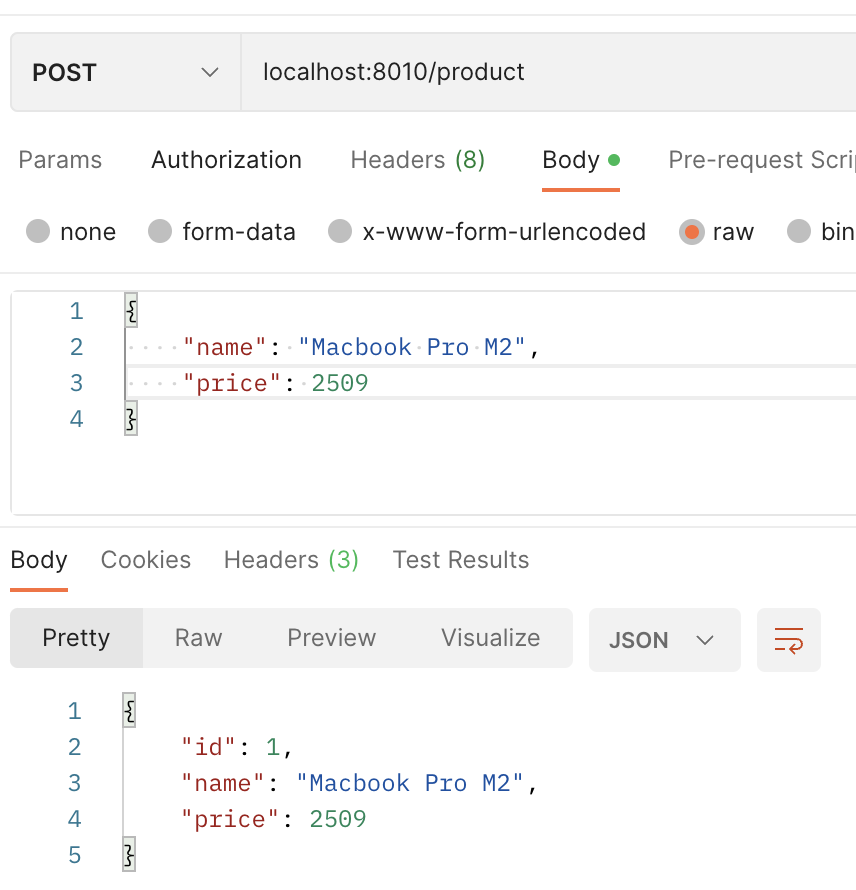

[](https://app.travis-ci.com/rambah/fh-mc-cicd-go)

# MC

Ramin Bahadoorifar

## Creating a PostgresDB

I created my PostgresDB with a `docker-compose.yaml` file, which can be started by running `docker compose up -d`

```yml
version: '3.8'
services:
  postgres:
    image: postgres:14.1-alpine
    restart: always
    environment:
      - POSTGRES_USER=postgres
      - POSTGRES_PASSWORD=password
    ports:
      - '5432:5432'
    volumes: 
      - postgres:/var/lib/postgresql/data
volumes:
  postgres:
    driver: local
```

## Semaphore Tutorial

I followed the semaphore tutorial and tested it at the end by executing the tests.



After that I started the server with

```shell
go run .
```

and run some POST Methods with Postman:



After that I executed a GET Method to get all products:



## Added Features

### Search by String

I modified the `getProducts(...)` function with a search feature.

```go
// app.go
func (a *App) getProducts(w http.ResponseWriter, r *http.Request) {
 count, _ := strconv.Atoi(r.FormValue("count"))
 start, _ := strconv.Atoi(r.FormValue("start"))
 searchStr := r.FormValue("searchStr") // <--- I added this line

 // [...]

 products, err := getProducts(a.DB, start, count, searchStr)
}
```

```go
// model.go
func getProducts(db *sql.DB, start, count int, searchStr string) ([]product, error) {
 var rows *sql.Rows
 var err error
 if searchStr == "" {
  rows, err = db.Query(
   "SELECT id, name,  price FROM products LIMIT $1 OFFSET $2",
   count, start)
 } else {
  rows, err = db.Query(
   "SELECT id, name, price FROM products WHERE LOWER(name) LIKE LOWER('%'||$1||'%') LIMIT $2 OFFSET $3", searchStr, count, start,
  )
 }
 [...]
```

Test with Postman:





### Reset Database

An Endpoint to reset the database.

```go
// app.go
func (a *App) resetDatabase(w http.ResponseWriter, r *http.Request) {
 if err := resetDatabase(a.DB); err != nil {
  respondWithError(w, http.StatusInternalServerError, err.Error())
  return
 }

 respondWithJSON(w, http.StatusOK, map[string]string{"result": "success"})
}
```

```go
// model.go
func resetDatabase(db *sql.DB) error {
 _, err := db.Exec("DELETE FROM products")
 if err != nil {
  return err
 }
 _, err = db.Exec("ALTER SEQUENCE products_id_seq RESTART WITH 1")

 return err
}
```

Test with Postman:

Database with filled products.



Reset the Database.



Test if all products have been deleted.



Create a Product, which should begin with the ID 1 again.



## Travis CI Integration

