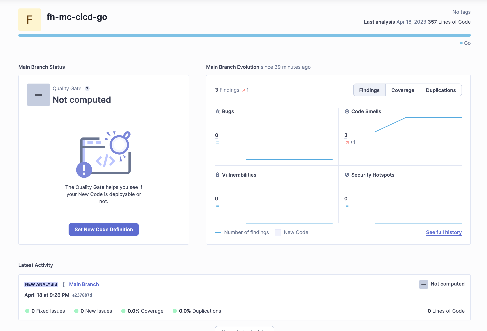

[](https://app.travis-ci.com/rambah/fh-mc-cicd-go)

# MC

Ramin Bahadoorifar
Github Link: [https://github.com/rambah/fh-mc-cicd-go](https://github.com/rambah/fh-mc-cicd-go)

## Travis CI Integration

My Travis configuration is different from the assignment description, since it didn't work for me :/

```yml
language: go
go:
  - 1.20.3
services:
  - postgresql
  
addons:
  sonarcloud:
    organization: "rambah"

env:
  - APP_DB_USERNAME=postgres APP_DB_NAME=postgres

script:
  - sonar-scanner
  # Build go
  - go build -v ./...
  # Test the code
  - go test -v ./...
```

And in TravisCI I set the secret env variables for the database password and SonarCloud:


Travis SignUp:


Travis Builds:


SonarCloud SignUp:


SonarCloud Analysis


Disable Automatic Analysis and implement Travis Configuration, to analyze code on push.

